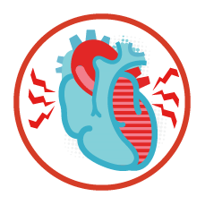

# README: Heart Attack

Author: Yiran Song

Last Revision Date: 12/11/2023

## Introduction



Cardiovascular diseases (CVDs) are the number 1 cause of death globally, taking an estimated 17.9 million lives each year, which accounts for 31% of all deaths worldwide. Heart failure is a common event caused by CVDs and this dataset contains 12 features that can be used to predict mortality by heart failure.

Most cardiovascular diseases can be prevented by addressing behavioral risk factors such as tobacco use, unhealthy diet and obesity, physical inactivity and harmful use of alcohol using population-wide strategies.

People with cardiovascular disease or who are at high cardiovascular risk (due to the presence of one or more risk factors such as hypertension, diabetes, hyperglycemia or already established disease) need early detection and management wherein a machine learning model can be of great help.

## A Quick View of Datasets and Results
- This project creates three models for predicting mortality caused by Heart Failure and evaluate the importance of explanatory variables.

### About the data:
- age: Age of the patient
- anaemia: If the patient had the haemoglobin below the normal range
- creatinine_phosphokinase: The level of the creatine phosphokinase in the blood in mcg/L
- diabetes: If the patient was diabetic
- ejection_fraction: Ejection fraction is a measurement of how much blood the left ventricle pumps out with each contraction
- high_blood_pressure: If the patient had hypertension
- platelets: Platelet count of blood in kiloplatelets/mL
- serum_creatinine: The level of serum creatinine in the blood in mg/dL
- serum_sodium: The level of serum sodium in the blood in mEq/L
- sex: The sex of the patient
- smoking: If the patient smokes actively or ever did in past
- time: It is the time of the patient's follow-up visit for the disease in months
- DEATH_EVENT: If the patient deceased during the follow-up period

## Using this Repository
This repository can be built by Docker. This command will create a docker container. 

```bash
docker build -t 611 .
```

Then we can start our customized container with the following command

```bash
docker run -v $(pwd):/home/rstudio\
           -p 8787:8787\
           -p 8080:8080\
           -e PASSWORD=yourpassword\
           -it 611
```
You then visit http://localhost:8787 via a browser on your machine to access the machine and development environment.

## What to Look at

If you want to generate a specific result, you can also do so by entering the following command:

```bash
make figures/figure1_age_by_death.png
```

The following command generate the final report (you need to first generate the results included in the report):

```bash
make report.pdf
```

## Acknowledgement
Davide Chicco, Giuseppe Jurman: Machine learning can predict survival of patients with heart failure from serum creatinine and ejection fraction alone. BMC Medical Informatics and Decision Making 20, 16 (2020). 
