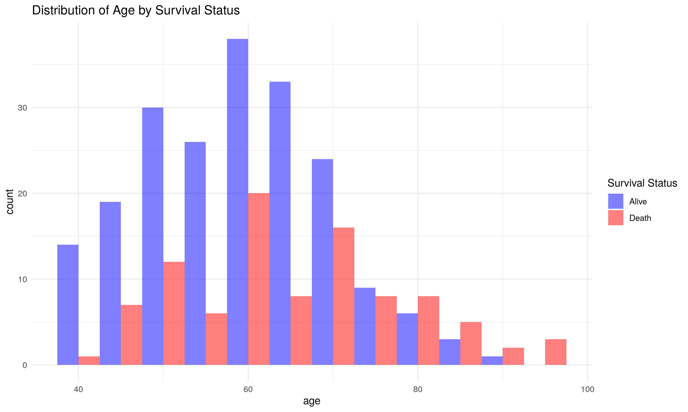
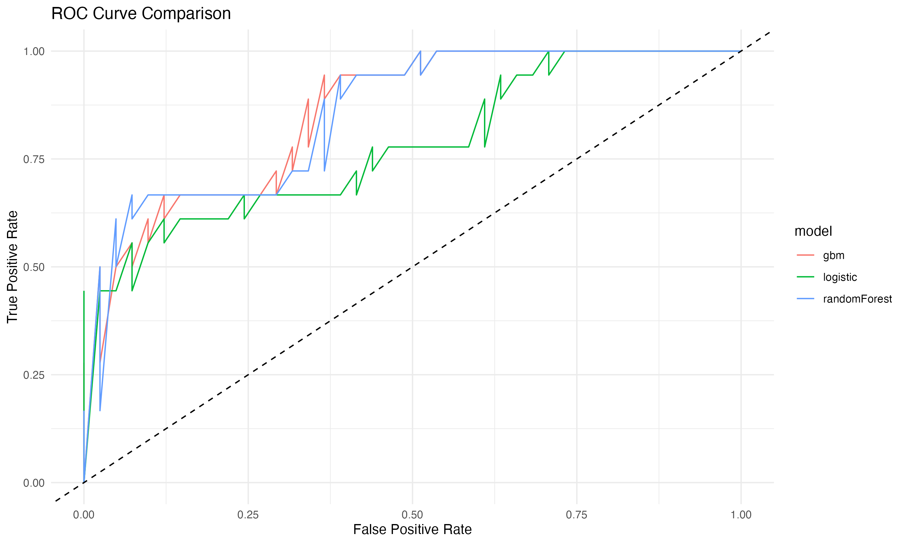

```{r setup, include=FALSE}
knitr::opts_chunk$set(echo = TRUE)
```

# Introduction

Cardiovascular diseases (CVDs) are the number 1 cause of death globally, taking an estimated 17.9 million lives each year, which accounts for 31% of all deaths worldwide. Heart failure is a common event caused by CVDs and this dataset contains 12 features that can be used to predict mortality by heart failure.

Most cardiovascular diseases can be prevented by addressing behavioral risk factors such as tobacco use, unhealthy diet and obesity, physical inactivity and harmful use of alcohol using population-wide strategies.

People with cardiovascular disease or who are at high cardiovascular risk (due to the presence of one or more risk factors such as hypertension, diabetes, hyperglycemia or already established disease) need early detection and management wherein a machine learning model can be of great help.

# Data

## Data Description

In this project, we use data data on 

The dataset specifically focuses on the .

| Variable Name                   | Meaning                                                                                                                                     |
|-------------------------|-----------------------------------------------|
| age                            | Age of the patient                                                                                                   |
| anaemia            | If the patient had the haemoglobin below the normal range                                                                        |
| creatinine_phosphokinase  | The level of the creatine phosphokinase in the blood in mcg/L
                                                |
| diabetes            | If the patient was diabetic
                                                 |
| high_blood_pressure   |    If the patient had hypertension                                            
                                                 |
| ejection_fraction   | Ejection fraction is a measurement of how much blood the left ventricle pumps out with each contraction   
                                                 |
| platelets   |    Platelet count of blood in kiloplatelets/mL
                                                 |
| serum_creatinine   |    The level of serum creatinine in the blood in mg/dL
                                                 |
| serum_sodium   |  The level of serum sodium in the blood in mEq/L
                                                 |
| sex   | The sex of the patient
                                                 |
| smoking   | If the patient smokes actively or ever did in past
                                                 |
| time   | It is the time of the patient's follow-up visit for the disease in months
                                                 |
| DEATH_EVENT   | If the patient deceased during the follow-up period
                                                 |

## Summary Plots

The response variable we've chosen here is death event by the heart attack . Figure 1 and Figure 2 respectively show the distribution of age by the response death.

```{r echo=FALSE, fig.cap="Distribution of age by Survival Status", out.width = '70%', fig.align="center"}

```

```{r echo=FALSE, fig.cap="Distribution of Ejection Fraction by Survival Status", out.width = '70%', fig.align="center"}

```

\newpage
Figure 3 shows the correlation plots between the response variable and several categorical explanatory variables.
Figure 4 shows that the response variable death event is imbalanced in the total number of 0 and 1.

```{r echo=FALSE, fig.cap="Correlation Plot for Categorical Variables", out.width = '70%', fig.align="center"}

```

```{r echo=FALSE, fig.cap="Distribution of Response", out.width = '60%', fig.align="center"}

```

\newpage
# Model

I adopt random forest, GBM (Gradient Boosting Machine) and Logistic models to do the prediction. The following table shows the AUC and Accuracy of the three models.

| Method                | AUC    | Accuracy |
| --------------------- | ------ | ------ |
| Random Forest         | 85.43% | 84.75% |
| GBM                   | 85.77% | 79.66% |
| Logistic              | 78.18% |77.97% |

```{r echo=FALSE, fig.cap="result ROC plot", out.width = '70%', fig.align="center"}

```

We can tell that the random forest model is a better model. The AUC is really high and the accuracy of the model is really good. We can conclude that this model is adequate. Figure 5 shows the relative variable importance in the random forest model. We can tell that time of the patient's follow-up visit is the most important indicator of having death event, with the level of serum creatinine in the blood in mg/dL and how much blood the left ventricle pumps out with each contraction following.   

\newpage
```{r echo=FALSE, fig.cap="Variable Importance in Random Forest", out.width = '90%', fig.align="center"}

```

# Furture Directions

Our study on heart attacks leads to some interesting questions for future research. We could look more into different causes, like genes or where people live. Also, studying how heart problems change over time would be helpful. We should check how well different treatments work and find out the best ways to stop heart attacks before they happen. Lastly, it's important to see if heart attacks affect different groups of people, like older or younger people, in unique ways. This research can help everyone understand and prevent heart attacks better.

# Acknowledgement
Davide Chicco, Giuseppe Jurman: Machine learning can predict survival of patients with heart failure from serum creatinine and ejection fraction alone. BMC Medical Informatics and Decision Making 20, 16 (2020). 

